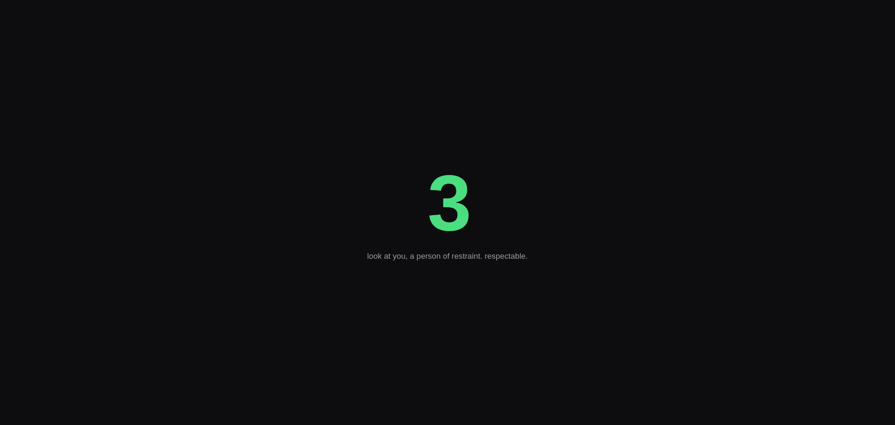
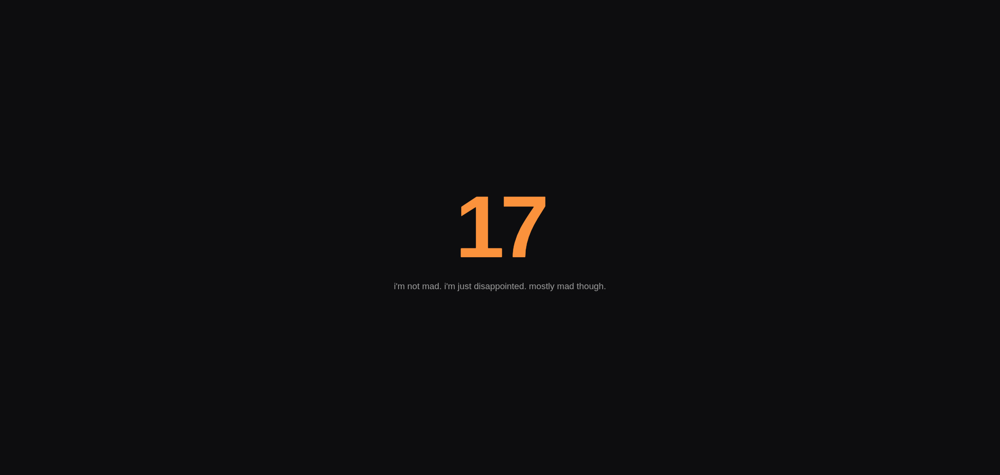
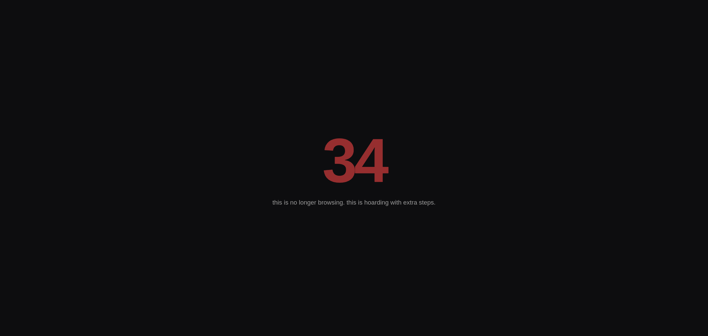
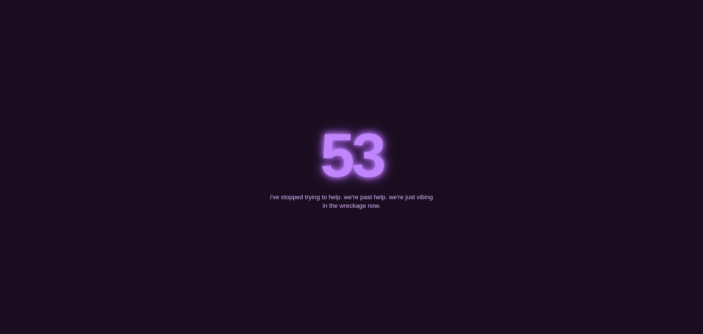

# Tab Shamer

A new tab page that counts how many tabs you have open and judges you for it, with increasing levels of betrayal.

## why i built this

I had 52 tabs open across 3 windows. One of them was a Wikipedia article about the history of the fork (the eating utensil, not git). I had no memory of opening it. I had no plan to ever read it.

I closed exactly zero tabs that day. Instead, I built this.

It's not going to fix your tab habit. Mine certainly didn't get fixed. But now every time you open a new tab, something looks you dead in the eye and says "we need to talk," and honestly that's more self-awareness than I had before.

No analytics, no tracking, no "premium" version, no accounts. It counts your tabs locally and says mean things to you locally. That's the whole product.

## what it actually does

- Replaces your new tab page
- Counts every open tab across every window
- Shows that number in big stupid letters
- Gives you a little message underneath, ranging from "you're fine" to "i am no longer able to help you"
- Background color slowly shifts from chill green to "something is wrong" purple as your tab count climbs

7 tiers total. The last one (50+) gets weird. You'll see.

## the descent

| 3 tabs | 17 tabs | 34 tabs | 53 tabs |
|---|---|---|---|
|  |  |  |  |

## installing this thing

This isn't on the Chrome Web Store (yet, maybe never, who knows). You'll have to load it manually, which takes about 30 seconds:

1. Clone or download this repo somewhere on your machine
2. Open Chrome and go to `chrome://extensions`
3. Toggle on **Developer mode** (top right corner)
4. Click **Load unpacked**
5. Select the `tab-shamer` folder
6. Open a new tab and face the consequences

That's it. No build step, no `npm install`, no nothing. It's just HTML, CSS, and JS sitting in a folder being judgmental.

## tech notes

Zero dependencies, zero frameworks, manifest v3. The only permission it asks for is `tabs`, which it needs to count how many you have open, and that's the entire reason this extension exists. It doesn't read tab contents, history, or anything else. It just counts.

If you want to mess with the messages or tiers, they're all in `newtab.js` in one big array near the top. Add your own roasts, change the thresholds, whatever. Make it meaner if you're brave.

## disclaimer

This extension will not help you manage your tabs. It will only make you feel bad about not managing your tabs. Slight difference, but an important one.
